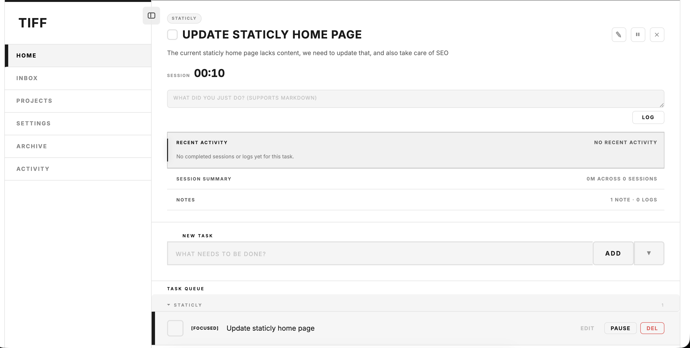

# TIFF - Todo In Your Focus

TIFF is a personal focus-first task manager built with SvelteKit and deployed on Cloudflare Workers. It combines inbox capture, project organization, focus session tracking, lightweight work logs, and project context in a single app.



## Features

- Focus mode with a live session timer, pause/resume controls, and quick switching between currently focused tasks.
- Inbox and task queue flows for creating, editing, completing, deleting, archiving, and restoring tasks.
- Deadlines with quick presets for today, tomorrow, or a custom date/time.
- Per-task notes and markdown-friendly activity logs.
- Focus session history with total tracked time and day-by-day activity summaries.
- Project hub for grouping tasks and maintaining project details.
- Project resources and file attachments backed by Cloudflare R2.
- GitHub repo linking per project, including cached repo stats, latest merged PR context, and README sync/copy/download actions.
- Activity calendar view for reviewing completed focus sessions over time.
- Theme settings for switching between the included visual styles.
- Cloudflare Access JWT validation in production, with a local development bypass using `dev@localhost`.

## Stack

- SvelteKit + Svelte
- Cloudflare Workers
- Cloudflare D1 as the primary datastore
- Cloudflare KV for cached GitHub metadata / compatibility storage
- Cloudflare R2 for project attachments

## Local development

```sh
npm install
npm run dev
```

`npm run dev` applies pending local D1 migrations before starting Vite.

During local development, `src/hooks.server.ts` bypasses Cloudflare Access validation and signs requests in as `dev@localhost`.

## Required Cloudflare setup

Update `wrangler.toml` with your own resources:

1. Create a D1 database and set `database_id`.
2. Create a KV namespace and set the `TIFF_KV` namespace id.
3. Create an R2 bucket and set the `TIFF_ATTACHMENTS` bucket names.

Apply database migrations:

```sh
npx wrangler d1 migrations apply tiff --local
npx wrangler d1 migrations apply tiff --remote
```

## Optional GitHub integration

Project repo sync uses a `GITHUB_TOKEN` Worker secret. Without it, linked repositories remain visible but remote sync and README refresh are unavailable.

```sh
npx wrangler secret put GITHUB_TOKEN
```

## Deploy

```sh
npm run build
npm run deploy
```

## Cloudflare Zero Trust Access

Production requests are protected with Cloudflare Access JWT validation.

1. In Cloudflare Zero Trust, create an Access application for your deployed Worker hostname.
2. Add at least one `Allow` policy for your users or groups.
3. Copy your team domain, for example `https://your-team.cloudflareaccess.com`.
4. Copy the application audience (`AUD`) from the Access app.
5. Save both values as Worker secrets:

```sh
npx wrangler secret put CF_ACCESS_TEAM_DOMAIN
npx wrangler secret put CF_ACCESS_AUD
```

6. Redeploy the app:

```sh
npm run deploy
```

If either secret is missing, the app returns `500`. Requests without a valid Access JWT return `401` or `403`.
